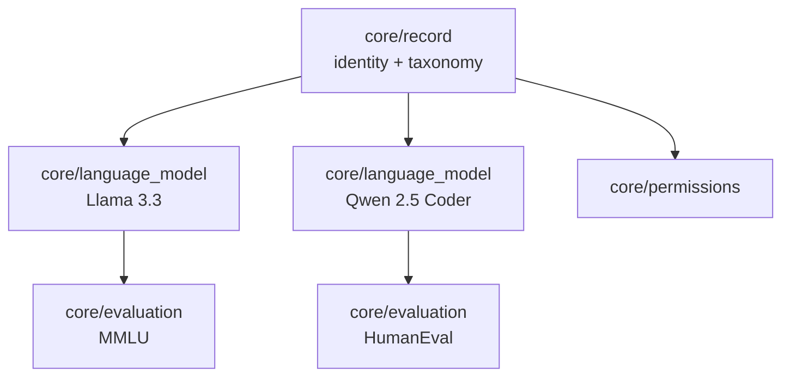

# OASF Data Models

This document describes how OASF data is structured, composed, and consumed.
The source of truth for field names and types is [proto/agntcy/oasf/](proto/agntcy/oasf/);
worked examples live under [examples/](examples/).

- [Overview](#overview)
- [Data Tree](#data-tree)
- [Module Composition](#module-composition)
- [Module Catalog](#module-catalog)
- [Authoring a New Module](#authoring-a-new-module)
- [Versioning](#versioning)

---

## Overview

OASF describes an agentic artifact (an agent, a model, a tool collection, an
MCP server, …) as a **record**. A record is a tree of typed **modules**; each
module carries a **payload** whose shape is defined by a proto message.

| Concept    | Purpose                                                                |
| ---------- | ---------------------------------------------------------------------- |
| **Record** | Root document. Identity + skills/domains taxonomy + modules tree.      |
| **Module** | Typed, composable node attached to a record or another module.         |
| **Object** | Reusable value type inside module payloads (e.g. `Artifact`).          |

---

## Data Tree

Every OASF document is a tree. The root is always a module of type
`core/record`; every other module hangs off the root, directly or indirectly.

### Node shape

Every node — the root and every module — uses the same envelope:

```json
{
  "type": "namespace/name",
  "annotations": { "...": "..." },
  "data":        { /* payload defined by the module type */ },
  "modules":     [ /* child modules (optional) */ ]
}
```

| Field         | Required | Purpose                                                                                          |
| ------------- | -------- | ------------------------------------------------------------------------------------------------ |
| `type`        | ✓        | Fully-qualified module type (`"core/record"`, `"core/language_model"`, `"integration/mcp"`, …). |
| `annotations` |          | Free-form `string → string` metadata. Not interpreted by the schema.                             |
| `data`        | ✓        | Typed payload; its shape is defined by the proto message for `type`.                             |
| `modules`     |          | Child modules scoped to this node.                                                               |

### Tree shape



Two rules govern the shape:

1. **Locality of authority** — a module describes or constrains only its own
   subtree. An `evaluation` under a `language_model` is about *that* model, not
   about the whole record.
2. **No cross-references** — modules do not name-link across the tree. If the
   same data belongs to two subtrees, place it in each subtree (or at their
   nearest common ancestor).

### The root: `core/record`

The root's `data` block carries the record's identity. Schema:
[modules/core/v1alpha1/record.proto](proto/agntcy/oasf/modules/core/v1alpha1/record.proto).

| Field              | Req. | Purpose                                                                     |
| ------------------ | ---- | --------------------------------------------------------------------------- |
| `schema_version`   | ✓    | OASF schema version this record targets (e.g. `"1.0.0"`).                   |
| `name`             | ✓    | Fully-qualified record name (`namespace/short-name`).                       |
| `version`          | ✓    | Record version. Distinct from the version of anything a module describes.   |
| `description`      | ✓    | Markdown-permitted human description.                                       |
| `created_at`       | ✓    | RFC 3339 timestamp.                                                         |
| `licenses[]`       |      | `{ name, url }`.                                                            |
| `publisher`        |      | `{ name, urls[] }`.                                                         |
| `skills[]`         |      | Paths from the OASF Skills taxonomy.                                        |
| `domains[]`        |      | Paths from the OASF Domains taxonomy.                                       |
| `authors[]`        |      | Free-form `Name <email>` strings.                                           |

### Minimal record

```json
{
  "type": "core/record",
  "data": {
    "schema_version": "1.0.0",
    "name": "org.example/hello",
    "version": "v1.0.0",
    "description": "Minimal example record.",
    "created_at": "2026-01-01T00:00:00Z"
  },
  "modules": []
}
```

---

## Module Composition

When a module type appears more than once in a subtree, its **composition
mode** decides how the instances combine. The composition mode is a
contract-level property of the module type and is declared in the first lines
of each module's proto docstring.

### Composition modes

| Mode          | Behaviour                                                                                                                                                                     | Used by                                                                            |
| ------------- | ----------------------------------------------------------------------------------------------------------------------------------------------------------------------------- | ---------------------------------------------------------------------------------- |
| **exclusive** | Appears at most once in the whole record, always at the root.                                                                                                                 | `core/record`                                                                      |
| **instance**  | Each occurrence is a distinct thing. Multiple instances are never merged; they enumerate. Every instance carries its own identifying fields (typically `name`, `version`).    | `core/language_model`, `core/agent_skills`, `integration/mcp`, `integration/a2a`   |
| **singleton** | At most one effective instance per subtree. A deeper instance **overrides** an outer instance for its subtree. Two siblings at the same level is a modelling bug.             | `core/permissions`, `core/requirements`                                            |
| **additive**  | Multiple instances contribute cumulatively. The effective payload for a subtree is the union of every instance in that subtree.                                               | `core/evaluation`                                                                  |

### Placement rules

- **exclusive** — only ever the root.
- **instance** — attach as a top-level child of the record (`core/language_model`,
  `integration/mcp`), or as a child of another instance when it is genuinely
  scoped to that parent.
- **singleton** — attach at the broadest scope where it applies. To tighten
  or override for a subtree, put another instance inside that subtree; it
  fully replaces the outer one for its descendants.
- **additive** — attach as close to what it describes as possible. Nesting a
  global `core/evaluation` under the root and per-model evaluations under each
  `core/language_model` is fine — consumers collect them all.

### Override example (singleton)

A record-level `core/permissions` grants `read` to a resource; a
`core/permissions` nested under one `integration/mcp` grants `read_write` to
the same resource. For that MCP subtree the inner permissions win entirely —
the outer permissions block is not merged with the inner one.

```json
{
  "type": "core/record",
  "data": { "...": "..." },
  "modules": [
    {
      "type": "core/permissions",
      "data": {
        "resources": [
          { "name": "local_filesystem", "description": "…", "access_level": "read" }
        ]
      }
    },
    {
      "type": "integration/mcp",
      "data": { "name": "playwright-mcp", "...": "..." },
      "modules": [
        {
          "type": "core/permissions",
          "data": {
            "resources": [
              { "name": "local_filesystem", "description": "…", "access_level": "read_write" }
            ]
          }
        }
      ]
    }
  ]
}
```

### Merge example (additive)

A `core/evaluation` under the root and another nested under a
`core/language_model` are both effective for that model — a consumer sees the
union of their `evaluations[]` entries.

### Resolving the effective view

Given a target module `M`, a consumer walks from the root down to `M`,
tracking ancestors. For every module type it cares about:

| Mode          | Resolution                                                                       |
| ------------- | -------------------------------------------------------------------------------- |
| **exclusive** | Take the root value.                                                             |
| **instance**  | `M` itself is the instance; no resolution needed.                                |
| **singleton** | Take the nearest ancestor's payload (deeper wins).                               |
| **additive**  | Collect every ancestor + in-subtree occurrence of that type; union the payloads. |

### Producer checklist

- [ ] Every module has a `type` and a `data` object.
- [ ] Every **instance** module carries its own identifying `name`/`version`.
- [ ] **Singleton** modules appear at most once per level; override by nesting.
- [ ] **Additive** modules are placed as close to what they describe as possible.
- [ ] External binaries and long payloads are referenced through `Artifact`,
      never inlined.

### Consumer checklist

- [ ] Treat unknown `type` values as opaque; retain and forward.
- [ ] Never assume module ordering; use the composition mode to reason about
      duplicates.
- [ ] Reject records whose `schema_version` you do not support.

---

## Module Catalog

Payload messages live under [proto/agntcy/oasf/modules/](proto/agntcy/oasf/modules/).

### Core

| `type`                | Composition | Purpose                                                                            | Proto                                                                                                     |
| --------------------- | ----------- | ---------------------------------------------------------------------------------- | --------------------------------------------------------------------------------------------------------- |
| `core/record`         | exclusive   | Identity + taxonomy of the document.                                               | [record.proto](proto/agntcy/oasf/modules/core/v1alpha1/record.proto)                 |
| `core/language_model` | instance    | One language model: deployments, context window, training vintage, artifacts.      | [language_model.proto](proto/agntcy/oasf/modules/core/v1alpha1/language_model.proto) |
| `core/agent_skills`   | instance    | One agent-skill package: name, capabilities, artifact bundle.                      | [agent_skills.proto](proto/agntcy/oasf/modules/core/v1alpha1/agent_skills.proto)     |
| `core/evaluation`     | additive    | Benchmark results attached to the parent subtree.                                  | [evaluation.proto](proto/agntcy/oasf/modules/core/v1alpha1/evaluation.proto)         |
| `core/requirements`   | singleton   | Runtime prerequisites (`binaries[]`, `env_vars[]`, `network[]`).                   | [requirements.proto](proto/agntcy/oasf/modules/core/v1alpha1/requirements.proto)     |
| `core/permissions`    | singleton   | Resources the subtree needs, with `read` / `write` / `read_write`.                 | [permissions.proto](proto/agntcy/oasf/modules/core/v1alpha1/permissions.proto)       |

### Integration

| `type`            | Composition | Purpose                                                                        | Proto                                                                                     |
| ----------------- | ----------- | ------------------------------------------------------------------------------ | ----------------------------------------------------------------------------------------- |
| `integration/mcp` | instance    | MCP server: transports, tools, prompts, resources, agent card artifact.        | [mcp.proto](proto/agntcy/oasf/modules/integration/v1alpha1/mcp.proto) |
| `integration/a2a` | instance    | Agent exposed via the Agent-to-Agent protocol.                                 | [a2a.proto](proto/agntcy/oasf/modules/integration/v1alpha1/a2a.proto) |

### Shared objects

Under [proto/agntcy/oasf/objects/v1/](proto/agntcy/oasf/objects/v1/):

| Object       | Fields                                                    |
| ------------ | --------------------------------------------------------- |
| `Artifact`   | `type`, `url`, `annotations`, `size`, `digest`            |
| `EnvVar`     | `name`, `description`, `required`                         |
| `HttpHeader` | `name`, `type`, `description`, `required`                 |

---

## Authoring a New Module

Adding a module type is a three-step change. Use the existing modules under
[proto/agntcy/oasf/modules/core/v1alpha1/](proto/agntcy/oasf/modules/core/v1alpha1/)
as templates.

### 1. Pick the type name

- Family: `core/`, `integration/`, or a third-party namespace (`ext.<org>/…`).
- Short name: `snake_case` (`core/telemetry`, `integration/slack`).
- The full type string is what appears in `type` on the wire.

### 2. Declare the payload in proto

Create `proto/agntcy/oasf/modules/<family>/v1alpha1/<name>.proto`:

```proto
syntax = "proto3";

package agntcy.oasf.modules.<family>.v1alpha1;

// <Name> is the payload for a Module of type "<family>/<name>".
// It describes ...
//
// Composition mode: <exclusive|instance|singleton|additive>. <one-line rationale>
message <Name> {
  // <field docs>
  string name = 1;
  // ...
}
```

Requirements:

- The docstring MUST name the module type on its first line.
- The docstring MUST state the composition mode — consumers depend on it.
- Reuse shared objects (`Artifact`, `EnvVar`, `HttpHeader`) instead of
  inlining equivalents.

### 3. Provide an example

Add or extend an example under [examples/](examples/) that exercises the new
module. If the module is `singleton`, show a nested override. If `additive`,
show two entries in one subtree. If `instance`, show two distinct entries.
Populate every required field.

### Design tips

- **Prefer many small modules over one large module.** If a payload branches
  internally (`if runtime == "local" then X else Y`), split it.
- **Keep instance modules symmetrical.** Each entry should describe one thing
  completely — never scatter one thing across multiple instances.
- **Use `annotations` for consumer-specific hints**, not for schema fields.
  If the same annotation shows up in every producer, promote it to a proper
  field in the next `v1alphaN`.
- **Never rely on sibling ordering.** If order matters, model it explicitly
  with an ordered field inside a single module payload.

---

## Versioning

- **Schema version** — the value in `data.schema_version` on the record.
  Follows the OASF release cadence
  (see [README.md](README.md#schema-versioning-and-immutability)).
- **Proto version** — the package suffix on messages (`v1alpha1`, `v1alpha2`,
  `v1`). See the compatibility matrix in [proto/README.md](proto/README.md).
- **Additive change** (new optional field) — non-breaking; ships in the
  current `v1alphaN`. Consumers ignore unknown fields.
- **Breaking change** (rename or remove) — introduce a new proto version,
  keep the old package intact for the current release, and migrate examples.
