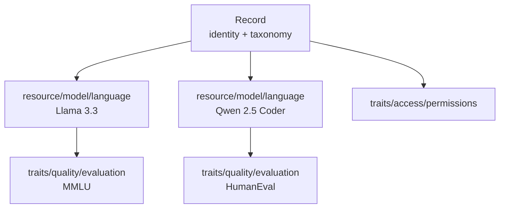

# OASF Data Models

This document describes how OASF data is structured, composed, and consumed.
The source of truth for field names and types is [proto/agntcy/oasf/](proto/agntcy/oasf/);
worked examples live under [examples/](examples/).

- [Overview](#overview)
- [Data Tree](#data-tree)
- [Module Taxonomy](#module-taxonomy)
- [Module Composition](#module-composition)
- [Module Catalog](#module-catalog)
- [Authoring a New Module](#authoring-a-new-module)
- [Versioning](#versioning)

---

## Overview

OASF describes an agentic artifact (an agent, a model, a tool collection, an
MCP server, …) as a **record**. A record is a tree of typed **modules**; each
module carries a **payload** whose shape is defined by a proto message.

| Concept    | Purpose                                                                |
| ---------- | ---------------------------------------------------------------------- |
| **Record** | Top-level document. Identity + skills/domains taxonomy + modules tree. |
| **Module** | Typed, composable node attached to a record or another module.         |
| **Object** | Reusable value type inside module payloads (e.g. `Artifact`).          |

---

## Data Tree

Every OASF document is a **Record**. The record itself is not a module (although it can be, but introduces breaking changes) — it is
the envelope that carries identity and hosts the root of a module tree.

### Record shape

`Record` is defined in
[types/v2alpha1/record.proto](proto/agntcy/oasf/types/v2alpha1/record.proto).
Its identity fields live directly on the record; the module tree hangs off
`modules[]`.

```json
{
  "schema_version": "1.0.0",
  "name": "org.example/hello",
  "version": "v1.0.0",
  "description": "Minimal example record.",
  "created_at": "2026-01-01T00:00:00Z",
  "modules": []
}
```

### Module envelope

Every module — at any depth — uses the same envelope, defined in
[types/v2alpha1/module.proto](proto/agntcy/oasf/types/v2alpha1/module.proto):

```json
{
  "type": "namespace/name",
  "annotations": { "...": "..." },
  "data":        { /* payload defined by the module type */ },
  "modules":     [ /* child modules (optional) */ ]
}
```

### Tree shape



Two rules govern the shape:

1. **Locality of authority** — a module describes or constrains only its own
   subtree. A `traits/quality/evaluation` under a `resource/model/language` is
   about *that* model, not about the whole record.
2. **No cross-references** — modules do not name-link across the tree. If the
   same data belongs to two subtrees, place it in each subtree (or at their
   nearest common ancestor).

---

## Module Taxonomy

Every module `type` string is a path made of tier segments. The first segment
identifies the module's **tier**; the tier fixes both its role and its
composition rules.

| Tier          | Prefix        | Role                                                       | Hosts children?                                    |
| ------------- | ------------- | ---------------------------------------------------------- | -------------------------------------------------- |
| **Resource**  | `resource/`   | An identified, addressable subject (a model, a skill, …).  | Yes — `traits/*` scoped to this subject.           |
| **Interface** | `interface/`  | An exposed surface (an MCP server, an A2A endpoint, …).    | Yes — `traits/*` scoped to this interface.         |
| **Traits**    | `traits/`     | A property attached to its parent (permissions, evaluation, requirements). | No — traits are leaves.                            |

> **Actors** (`actor/*`) — compound subjects such as `actor/agent`,
> `actor/crew`, `actor/workflow` — are reserved for a follow-up round and are
> not yet in the catalog. Actors are the only tier that will be allowed to
> host other subject tiers (`resource/*`, `interface/*`) as children in
> addition to `traits/*`.

### Placement rule

- **Resources** and **interfaces** live under the record root (or, in future,
  under an actor). They may nest `traits/*` for anything scoped just to that
  subject.
- **Traits** attach either at the record root (record-wide scope) or under a
  single subject (subject-scoped). Traits do **not** host other modules.

---

## Module Composition

Composition is a contract-level property of the module type and is declared
in the first lines of each module's proto docstring.

### Composition modes

| Mode         | Behaviour                                                                                                                                                                        | Used by                                                                                             |
| ------------ | -------------------------------------------------------------------------------------------------------------------------------------------------------------------------------- | --------------------------------------------------------------------------------------------------- |
| **instance** | Each occurrence is a distinct thing. Multiple instances are never merged; they enumerate. Every instance carries its own identifying fields (typically `name`, `version`).       | All `resource/*`, all `interface/*`                                                                 |
| **replace**  | At most one effective instance per subtree. A deeper instance **replaces** the outer one for its subtree. To accumulate across scopes, include the full desired set on each one. | All `traits/*` (`traits/access/permissions`, `traits/quality/evaluation`, `traits/runtime/requirements`) |

### Placement guidance

- **instance** modules attach as top-level children of the record (or, in
  future, of an actor) when they describe a distinct subject. Nest them under
  a parent subject only when they are genuinely scoped to that parent.
- **replace** modules attach at the broadest scope where they apply. To
  tighten or override for a subtree, place another instance inside that
  subtree; it fully replaces the outer one for its descendants.

### Replace example

A record-level `traits/access/permissions` grants `read` to a resource; a
`traits/access/permissions` nested under one `interface/framework/mcp` grants
`read_write` to the same resource. For that MCP subtree the inner
permissions win entirely — the outer permissions block is not merged.

```json
{
  "schema_version": "1.0.0",
  "name": "org.example/agents",
  "version": "v1.0.0",
  "description": "…",
  "created_at": "2026-01-01T00:00:00Z",
  "modules": [
    {
      "type": "traits/access/permissions",
      "data": {
        "resources": [
          { "name": "local_filesystem", "description": "…", "access_level": "read" }
        ]
      }
    },
    {
      "type": "interface/framework/mcp",
      "data": { "name": "playwright-mcp", "...": "..." },
      "modules": [
        {
          "type": "traits/access/permissions",
          "data": {
            "resources": [
              { "name": "local_filesystem", "description": "…", "access_level": "read_write" }
            ]
          }
        }
      ]
    }
  ]
}
```

### Accumulating with `replace`

Because traits use *replace* semantics, authors that want cumulative behaviour
(e.g. carrying an outer set of evaluations plus a subject-specific one) must
include the full desired list on the inner instance. The schema does not
merge lists across levels.

### Resolving the effective view

Given a target module `M`, a consumer walks from the record down to `M`,
tracking ancestors. For every module type it cares about:

| Mode         | Resolution                                                                             |
| ------------ | -------------------------------------------------------------------------------------- |
| **instance** | `M` itself is the instance; no resolution needed.                                      |
| **replace**  | Take the nearest ancestor's payload (deeper wins). Do not merge with outer instances.  |

### Producer checklist

- [ ] Every module has a `type` and a `data` object.
- [ ] Every **instance** module (`resource/*`, `interface/*`) carries its own
      identifying `name` (and `version` where applicable).
- [ ] **Replace** modules (`traits/*`) appear at most once per level; override
      by nesting, and repeat the full desired set if accumulation is intended.
- [ ] External binaries and long payloads are referenced through `Artifact`,
      never inlined.

### Consumer checklist

- [ ] Treat unknown `type` values as opaque; retain and forward.
- [ ] Never assume module ordering; use the composition mode to reason about
      duplicates.
- [ ] Reject records whose `schema_version` you do not support.

---

## Module Catalog

Payload messages live under [proto/agntcy/oasf/modules/](proto/agntcy/oasf/modules/),
grouped by tier and family.

### Resource

| `type`                      | Composition | Purpose                                                                       | Proto                                                                                                        |
| --------------------------- | ----------- | ----------------------------------------------------------------------------- | ------------------------------------------------------------------------------------------------------------ |
| `resource/model/language`   | instance    | One language model: deployments, context window, training vintage, artifacts. | [language.proto](proto/agntcy/oasf/modules/resource/model/v1alpha1/language.proto)                           |
| `resource/skill/agentskill` | instance    | One Agent Skills package: manifest, capabilities, artifact bundle.            | [agentskill.proto](proto/agntcy/oasf/modules/resource/skill/v1alpha1/agentskill.proto)                       |
| `resource/skill/prompt`     | instance    | One reusable prompt template.                                                 | [prompt.proto](proto/agntcy/oasf/modules/resource/skill/v1alpha1/prompt.proto)                               |

### Interface

| `type`                    | Composition | Purpose                                                                 | Proto                                                                             |
| ------------------------- | ----------- | ----------------------------------------------------------------------- | --------------------------------------------------------------------------------- |
| `interface/framework/mcp` | instance    | MCP server: transports, tools, prompts, resources, agent card artifact. | [mcp.proto](proto/agntcy/oasf/modules/interface/framework/v1alpha1/mcp.proto)     |
| `interface/framework/a2a` | instance    | Agent exposed via the Agent-to-Agent protocol.                          | [a2a.proto](proto/agntcy/oasf/modules/interface/framework/v1alpha1/a2a.proto)     |

### Traits

| `type`                        | Composition | Purpose                                                          | Proto                                                                                             |
| ----------------------------- | ----------- | ---------------------------------------------------------------- | ------------------------------------------------------------------------------------------------- |
| `traits/access/permissions`   | replace     | Resources the subtree needs, with `read` / `write` / `read_write`. | [permissions.proto](proto/agntcy/oasf/modules/traits/access/v1alpha1/permissions.proto)           |
| `traits/quality/evaluation`   | replace     | Benchmark results attached to the parent subtree.                | [evaluation.proto](proto/agntcy/oasf/modules/traits/quality/v1alpha1/evaluation.proto)            |
| `traits/runtime/requirements` | replace     | Runtime prerequisites (`binaries[]`, `env_vars[]`, `network[]`). | [requirements.proto](proto/agntcy/oasf/modules/traits/runtime/v1alpha1/requirements.proto)        |

### Shared objects

Under [proto/agntcy/oasf/objects/v1/](proto/agntcy/oasf/objects/v1/):

| Object       | Fields                                                    |
| ------------ | --------------------------------------------------------- |
| `Artifact`   | `type`, `url`, `annotations`, `size`, `digest`, `data`            |
| `EnvVar`     | `name`, `description`, `required`                         |
| `HttpHeader` | `name`, `type`, `description`, `required`                 |

---

## Authoring a New Module

Adding a module type is a three-step change. Use the existing modules under
[proto/agntcy/oasf/modules/](proto/agntcy/oasf/modules/) as templates.

### 1. Pick the type name

- Choose a tier: `resource/`, `interface/`, or `traits/`.
- Add a family segment: `resource/model/…`, `interface/framework/…`,
  `traits/access/…`. Third-party namespaces should include a publisher
  prefix (`<reverse-dns>/…`).
- Short name: `snake_case` or `lowercase` (`resource/model/language`,
  `interface/framework/mcp`).
- The full type string is what appears in `type` on the wire.

### 2. Declare the payload in proto

Create `proto/agntcy/oasf/modules/<tier>/<family>/v1alpha1/<name>.proto`:

```proto
syntax = "proto3";

package agntcy.oasf.modules.<tier>.<family>.v1alpha1;

// <Name> is the payload for a Module of type "<tier>/<family>/<name>".
// It describes ...
//
// Composition mode: <instance|replace>. <one-line rationale>
message <Name> {
  // <field docs>
  string name = 1;
  // ...
}
```

Requirements:

- The docstring MUST name the module type on its first line.
- The docstring MUST state the composition mode — consumers depend on it.
- Reuse shared objects (`Artifact`, `EnvVar`, `HttpHeader`) instead of
  inlining equivalents.
- Traits (`traits/*`) are leaves — never host child modules.

### 3. Provide an example

Add or extend an example under [examples/](examples/) that exercises the new
module. If the module is `replace`, show a nested override. If `instance`,
show two distinct entries. Populate every required field.

### Design tips

- **Prefer many small modules over one large module.** If a payload branches
  internally (`if runtime == "local" then X else Y`), split it.
- **Keep instance modules symmetrical.** Each entry should describe one thing
  completely — never scatter one thing across multiple instances.
- **Use `annotations` for consumer-specific hints**, not for schema fields.
  If the same annotation shows up in every producer, promote it to a proper
  field in the next `v1alphaN` of that module.
- **Never rely on sibling ordering.** If order matters, model it explicitly
  with an ordered field inside a single module payload.

---

## Versioning

OASF has three independent versioning axes:

- **Schema version** — the value in `schema_version` on the record.
  Follows the OASF release cadence
  (see [README.md](README.md#schema-versioning-and-immutability)).
- **Types version** — the package suffix on `Record` and `Module`
  (currently `types/v2alpha1`). Changes to the top-level envelopes.
- **Module version** — each module family carries its **own** version
  suffix, e.g. `modules/resource/model/v1alpha1/language.proto` or
  `modules/traits/access/v1alpha1/permissions.proto`. Families evolve
  independently: bumping `resource/model` does not force a bump in
  `traits/access`.

Change semantics per axis:

- **Additive change** (new optional field) — non-breaking; ships in the
  current `v1alphaN`. Consumers ignore unknown fields.
- **Breaking change** (rename or remove) — introduce a new proto version
  for that specific family, keep the old package intact for the current
  release, and migrate examples.
